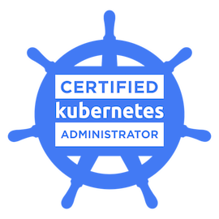

<h1 align="center">
  
</h1>

- 🔭 Focusing on (DevOps + Site Reliability + Cloud).😎
- 🌱 Trying to become an expert in DevOps Engineer ❤
- 💻 I love exploring new tech stacks and automating stuff.
- 📰 Reading tech documentation whenever possible.
- 🥅 2025 Goals: Learn Cloud on Azure and GCP.

---

### 🔰 Let's Connect:

---

### ♨ Languages and Tools:

---

### 🏆 Certifications:

  <table>
    <tr>
      <td align="center">
        
        
AWS CERTIFIED SECURITY SPECIALTY

      </td>
      <td align="center">
        
        
CERTIFIED KUBERNETES ADMINISTRATOR

      </td>
      <td align="center">
        
        
AWS PARTNER TECHNICAL ACCREDITED

      </td>
    </tr>
    <tr>
      <td align="center">
        
        
PAGERDUTY FOUNDATIONAL PRACTITIONER

      </td>
      <td align="center">
        
        
INCIDENT MANAGEMENT CERTIFICATION

      </td>
      <td align="center">
        
        
PAGERDUTY EVENT INTELLIGENCE CERTIFICATION

      </td>
    </tr>
  </table>

---
<!---
Ahmed-U-Github/Ahmed-U-Github is a ✨ special ✨ repository because its `README.md` (this file) appears on your GitHub profile.
You can click the Preview link to take a look at your changes.
--->
